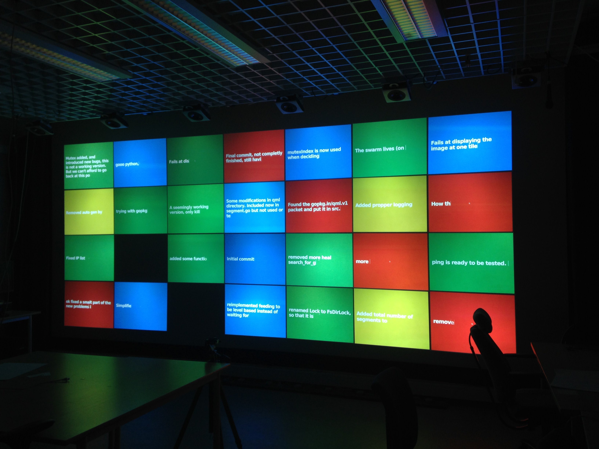

# Gittiles
A little tool that visualized github commit messages using the [Google Trends
thing](https://www.google.com/trends/hottrends/visualize?pn=p51) for the
INF-3200 course the fall of 2014. The original commit messages have been removed from
this repository. 

 

